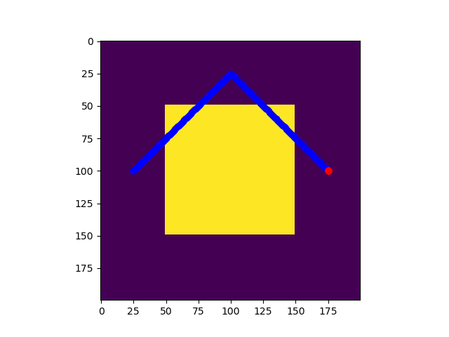
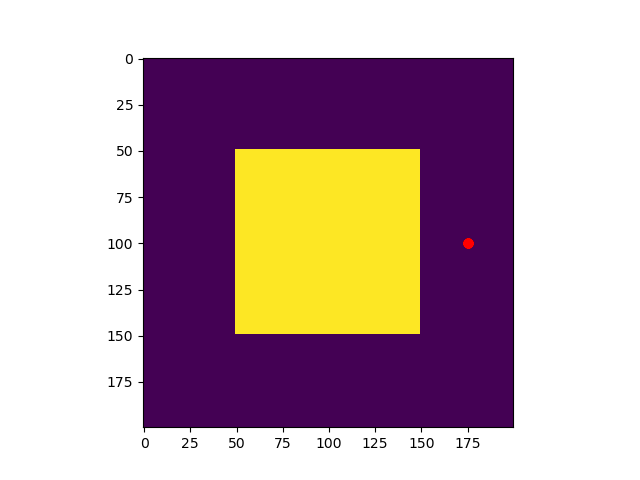

# Summary of the Planner
Summary of the Planner Algorithm:

The code implements a path planning algorithm for a robot in a grid-based environment. In essence, the algorithm is guranteed to find the optimal path (considering cost as grid's cell cost) from the robot's start position to the end of the target's trajectory. This algorithm gurantees completeness in a sense that it will always be able to catch the target if the target's end position is reachable from the robot's start position in the given duration. By following the optimal path, the robot might not be able to catch the target in certain cases (map 5), in that case the algorithm still gurantees to catch the target (if its end position is reachable within the time limit) using a sub-optimal path.

Here's a breakdown of the key aspects of the algorithm:

* Search Space Representation:   

        The algorithm represents the search space as a graph, where each cell in the grid is a node. Each node is represented as a 'State' struct, which includes the cell's (x, y) coordinates, a cost 'g' from the start node to the current node, a heuristic 'h' (Diagonal distance to the target), a pointer to its parent state, and a flag to indicate if the state is in the open list. Having the flag in the state struct allows for efficient lookup of states in the open list without having to iterate through the list or use a hash table (thus simplifying the code). 
        Ref: https://en.wikipedia.org/wiki/A*_search_algorithm#Pseudocode

* Search Algorithm:   

        The algorithm uses the A* search algorithm to find the optimal path from the robot's current position to a target position.
        A priority queue (min-heap) is used as the 'open list' to maintain states to explore. States with lower total cost ('g' + 'h') are given higher priority.
        A 2D vector 'closed list' is used to keep track of explored states to avoid revisiting them.
        A 2D vector 'open_list_set' is used to keep track of states and access them efficiently in the open list.

* Heuristics:   

        The algorithm uses a heuristic function to estimate the cost from the current state to the goal state. The heuristic used is the Diagonal distance between the current state and the goal state. This heuristic is consistent, which means that the value 'g' of a state is guaranteed to be optimal if that state has been explored. Hence, the need to check the new value of 'g' against the old value of 'g' for a state is eliminated.

* Path Backtracking:   

        After reaching the goal state, the algorithm backtracks to extract the optimal path by following the parent pointers from the goal state to the start state (till the parent pointer is NULL).

* Replanning:   

        The algorithm supports dynamic replanning, which is triggered when a replanning flag is set. 
        Replanning clears the open list, closed list, and associated data structures.
        If the robot trajectory becomes longer than the target trajectory, replanning is triggered. In this case, the algorithm replans from the current robot position to the end of the target trajectory and gives priority to states that are closer to the target trajectory than the cell cost.

* Efficiency and Memory Management:    

        To minimize memory overhead, the 'open list' is implemented as a priority queue, and states are added to it as they are generated.
        Memory is efficiently managed by using static variables for the open list, closed list, and other data structures that need to persist between planning iterations.
        The algorithm utilizes a lambda functions to backtrack the path from the goal state to the start state and to get the next action to take from the current state.
        The code includes checks to ensure that states are within the grid boundaries and are not obstacles.

* Global Variables:   

        The algorithm uses a few global variables, such as 'flag,' 'is_planning_done,' 'replanning_needed,' and 'ignore_cell_cost,' to manage planning and replanning.
        These could also be difined as static variables within the class to avoid global variables.        

# Results
## Legend:

        Blue: Robot
        Red: Target

* Map 1:   
    
        target caught = Yes
        time taken (s) = 5344
        moves made = 421
        path cost = 5344

    

    
    
    
    

* Map 2:   

        target caught = Yes
        time taken (s) = 5244
        moves made = 1731
        path cost = 9674787

    

    
    
    
    

* Map 3:   

        target caught = 1
        time taken (s) = 791
        moves made = 283
        path cost = 791

    

    
    
    
    

* Map 4:   

        target caught = 1
        time taken (s) = 791
        moves made = 336
        path cost = 70271

    

    
    
    
    

* Map 5:   

        target caught = 1
        time taken (s) = 151
        moves made = 150
        path cost = 2552

    

    
    
    
    

* Map 6:   

        target caught = 1
        time taken (s) = 140
        moves made = 0
        path cost = 2800

    

    
    
    
    

* Map 7:   

        target caught = 1
        time taken (s) = 296
        moves made = 296
        path cost = 296

    

    
    
    
    

* Map 8:   

        target caught = 1
        time taken (s) = 451
        moves made = 410
        path cost = 451

    

    
    
    
    

* Map 9:   

        target caught = 1
        time taken (s) = 600
        moves made = 352
        path cost = 600

    

    
    
    
    

#### Instructions for compiling code are the same as that provided in the homework description pdf.    